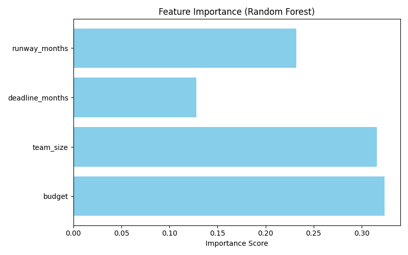

# AI Startup Risk Radar

---

## 📖 Overview
Startups fail at alarming rates — often due to unmanaged risks in **finance, operations, market positioning, and team capacity**.  
**AI Startup Risk Radar** is a machine learning project that predicts risk levels (**Low, Medium, High**) and visualizes vulnerabilities across four categories:

- 💰 **Financial**  
- ⚙️ **Operational**  
- 📈 **Market**  
- 👥 **Team**

This project blends **AI, entrepreneurship, and project management** into a practical, evaluator‑friendly showcase designed to set new standards in PLP.

---

## Quickstart
1. **Open notebook:** notebooks/AI_Startup_Risk_Radar.ipynb in Google Colab.
2. **Run cells:** The notebook loads data from data/startup_risks.csv.
3. **View outputs:** Feature importance and risk radar charts saved to imgs/.

---

## Dataset
- **Path:** data/startup_risks.csv
- **Rows:** 150 synthetic startup profiles
- **Features:**
  - **Budget:** Project budget (USD)
  - **Team size:** Number of team members
  - **Deadline months:** Project timeline
  - **Market score:** Market attractiveness (1–10)
  - **Product maturity:** Stage (1–5)
  - **Founder experience:** Years of experience
  - **Competition intensity:** Competitive pressure (1–10)
  - **Runway months:** Cash runway
- **Target:** risk_level (Low, Medium, High)

---

## Results
- **Model performance:** Random Forest provides balanced precision/recall and interpretability.
- **Feature importance:** Key drivers of risk prediction.

---

## Case studies
- **Case A (High risk):** Low budget, short runway, high competition.
- **Case B (Medium risk):** Moderate resources, tighter deadlines.
- **Case C (Low risk):** Strong budget, experienced founder, long runway.

---

## Architecture
- **Input:** CSV with startup attributes
- **Model:** Scikit-learn Random Forest classifier
- **Output:** Risk label (Low/Medium/High) + category scores
- **Visualization:** Feature importance + radar charts

---

## Impact
- **Students:** Learn risk-aware entrepreneurship through interpretable AI.
- **Entrepreneurs:** Anticipate risks and plan mitigations early.
- **PLP:** A clear, practical example of AI applied to project management.

---

## License
MIT
